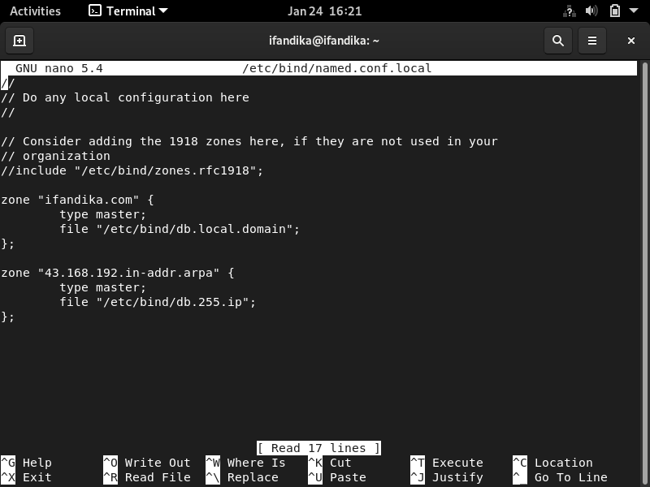
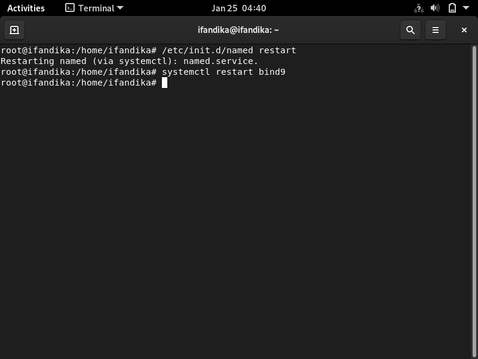

## Instalasi & Konfigurasi Bind9 Debian11.3

### Pengertian Bind9


### Instalasi & Konfigurasi
**1.** Pertama kita set network interface, disini menggunakan **DHCP** dan adapter **Bridge Adapter > Wireless**.


Untuk IP yang didapat.

- 192.168.43.81


**2.** Kemudian install bind9.
```Txt
$ apt update
$ apt upgrade
$ apt install bind9 bind9utils dnsutils
```
Jika sudah terinstal.


**3.** Lalu konfigurasi file-file bind, untuk direktori bind9 ada pada **/etc/bind/**. Pertama kita buat saalinan untuk file yang akan dirubah agar file asli masih ada. 

- **db.255**
- **db.local**
- **named.conf.local (opsional)**

Untuk perintah menyalin **cp "nama_file" "nama_file_salinan"**.
```Txt
$ cp db.255 db.255.ip
$ cp db.local db.local.domain
// Untuk yang file named.conf.local saya tidak menyalin
```
Lalu edit isi file **named.conf.local**.
```Txt
$ nano /etc/bind/named.conf.local
```


**Ket:**

- **zone "ifandika.com" { ... } = Untuk menghadle response lookup domain.**
- **file "/etc/bind/db.local.domai" yang akan dipanggil ketika lookup domain.**
- **zone 43.168.192.in-addr.arpa { ... } = Untuk menghandle response lookup IP.**
- **IP yang dimasukan di in-addr.arpa secara terbalik dan 3 digit dari belakang, jika full 4 digit maka akan eror NXDOMAIN.**
- **file "/etc/bind/db.255.ip" yang akan dipanggil ketika lookup IP.**

Lalu edit pada file **db.255.ip**.
```Txt
$ nano /etc/bind/db.255.ip
```


**Ket:**

- **ifandika.com. adalah FDN (Full Domain Name), format dari bind diakhiri dengan (.)..**
- **81 adalah nilai IP terakhir, karena IP yang saya dapat 192.168.43.81 maka nilai 81 kita masukan.**

Lalu edit pada file **db.local.domain**.
```Txt
$ nano /etc/bind/db.local.domain
```


Lalu kita edit file **named.conf.options**.
```Txt
$ nano /etc/bind/named.conf.options
```


**4.** Edit file dns atau resolv.conf, rubah nameserver menggunakan IP debian.
```Txt
$ nano /etc/resolv.conf
```


**5.** Lalu pada file hosts.
```Txt
$ nano /etc/hosts
```


**Ket:**

- **192.168.43.81 IP debian.**
- **ifandika.com nama domain.**

**5.** Lalu restart service bind9.



#### [Catatan]
Lalu cek isi file **/etc/resolv.conf** jika nameserver berubah ke IP gateway jaringan maka rubah lagi dan restart bind9.

**10.** Lalu coba ping ke google untuk cek DNS forwardnya.


**11.** Kita cek konfigurasi dns dengan dig atau nslookup.

- Jika menggunakan nslookup.


- Jika menggunakan dig.


#### Pengujian dari klien Windows
**11.** Pertama kita masukan dns/IP debian ke dns pada Adapter Wireless (Disini karena sumber internet menggunakan wireless) ke **Control Panel > Network > Change Adapter Setting > Wireless Adapter**.


Lalu pengujian bisa lewat CMD, PowerShell, dll.


Untuk pengujian ping.


Bisa juga untuk mengakses lewat browser menggunakan nama domain.

